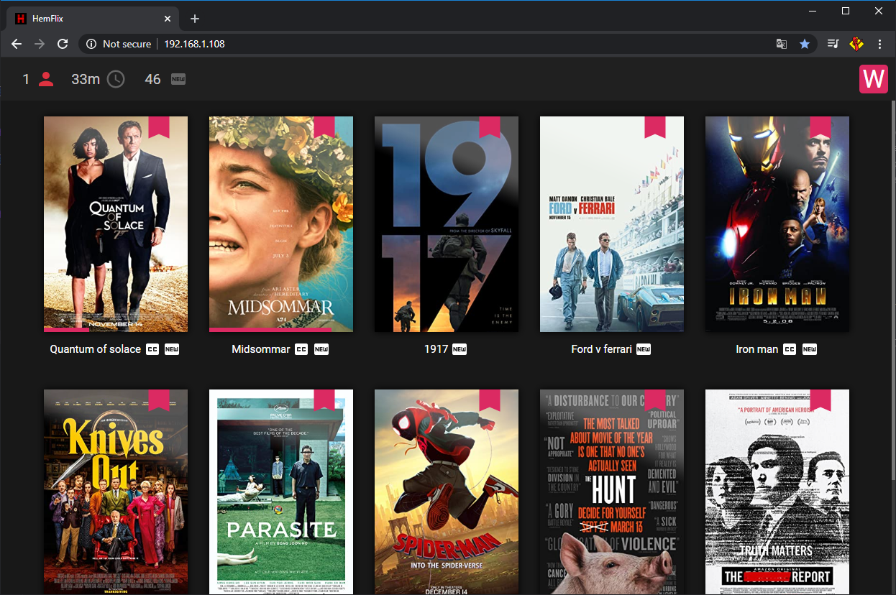
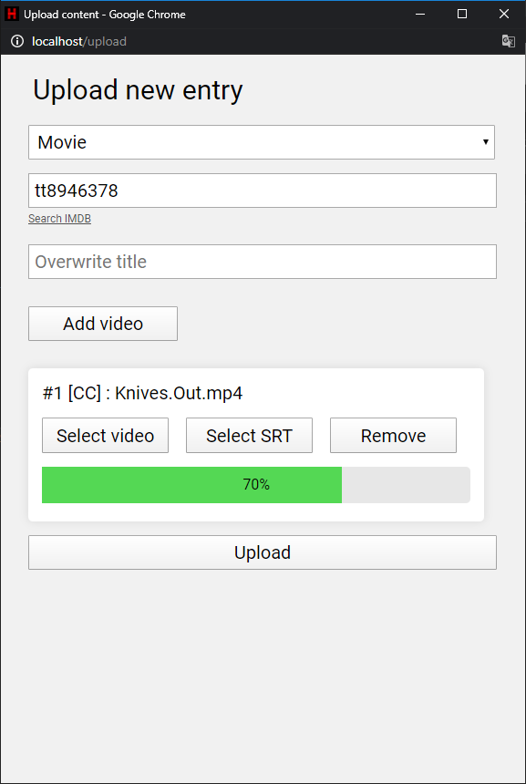

# HemFlix (HomeFlix)
### Home media server solution

## Features
* Keeps track of where you are in each title, for multible users
* Upload movies and TV series via a webrowser
* Downloads Meta data and poster from IMDB
* Supports subtitles (Converts SRT to VTT)
* Native HTML5 player



## Installation

Prerequisites: Node.js with npm

1. Clone the repo ```git clone https://github.com/Yogsther/HemFlix```
2. Install node modules ```npm i```
3. Start it ```node index.js```

Now the website should be live at http://localhost.
If you don't want the port to be 80, configure config.json


## Upload movies and TV series

To access the admin deck, click the manage link in the bottom left corner at the user select screen, or just navigate to /admin

On the admin page you can delete movies, delete users and set users colors.
If you click on the upload button, an upload window will open.

To upload, click the Add video and select the video file. If you are uploading a series, change the Movie drop down to TV - and you can add more videos.

All you need to provide is the video / subtitle files and the IMDB ID.


**Tip!** The "Search IMDB" link redirects you to IMDB with a search term that matches the file upload without the file extension, it works most of the time.

    https://www.imdb.com/title/tt8772262
                               ^^^^^^^^^

**NOTE** If you upload something with the same title, it will overwrite the old entry. So use the overwrite title field when uploading e.g seasons of a tv series.




## Recover database
Incase you accidentaly delete your db.json (like I did) you can use recover.js
and it will rebuild it from the files in cdn/stream. It wo'nt recover meta data or users but you won't have to reupload everything.
